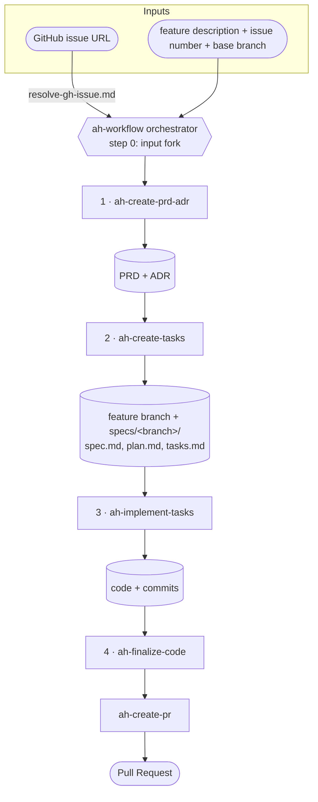

# Architecture Overview

`arinhub` is a collection of Claude Code **`ah-*` skills** that together form an end-to-end,
agent-driven feature-development pipeline: from a GitHub issue (or a plain feature description)
all the way to an opened Pull Request.

The center of the architecture is **`ah-workflow`**, which is both the **entry point** and the
**orchestrator-of-orchestrators**. It runs four phases in order, launching one subagent per phase
(each phase skill is itself a multi-step workflow), and carries the right inputs forward between
them. A workflow progress file is the source of truth that records each phase's result and anchors
the run via the `/goal` command, with per-phase retry + escalation so a stuck phase never loops
forever.

Alongside the pipeline, several **auxiliary `ah-*` skills** operate on an already-existing
PR or branch (review, submit review, resolve review threads, verify requirements coverage) or
debug UI issues against a running browser.

## ah-workflow pipeline

Notes on data flow between phases:

- **Input fork (step 0).** If the input is a GitHub issue URL, `ah-workflow` resolves it in the
  main session via `skills/ah-workflow/references/resolve-gh-issue.md`, yielding the feature
  description, issue number, base branch, and mode. Otherwise the three classic inputs are taken
  directly from the prompt.
- **PRD/ADR paths flow 1 → 2.** Phase 1 produces the PRD and ADR; their paths are passed into
  phase 2.
- **Base branch via checkout.** `ah-create-tasks` does not take a base branch as an argument — it
  reads `git branch --show-current`. The orchestrator must `git checkout <base-branch>` _before_
  phase 2, which then branches the feature branch off it.
- **spec.md metadata flows 2 → 3..4.** Phase 2 writes the base branch and issue number into
  `spec.md`, so later phases read them directly rather than being re-threaded.
- **`ah-create-pr` is not a separate phase** — `ah-finalize-code` calls it at the end of phase 4.

## Inputs

- **One of:** a GitHub issue URL, **or** a feature description + issue number + base branch.
- **Base branch** is set as the current checkout before phase 2 (it determines where the PR
  targets and is never guessed).
- **PRD + ADR paths** flow from phase 1 into phase 2.
- **`specs/<branch>/` + `spec.md` metadata** flow from phase 2 into phases 3–4.
- Optional directives: `mode feature|update`, `dry-run`, `skip <phase>`, `max-retries N`,
  `resume`.

## Outputs

- **PRD + ADR** under `~/.agents/prds/` and `~/.agents/adrs/`.
- **Feature branch + `specs/<branch>/`** (`spec.md`, `plan.md`, `tasks.md`).
- **Implemented code + commits** (each phase skill commits via its own internal `committer`).
- **Pull Request** (created/updated via `ah-create-pr`).

## Auxiliary skills

These operate on an existing PR or branch and are invoked on demand, outside the pipeline:

- **`ah-review-code`** — review local branch changes or a remote PR (by ID/URL).
- **`ah-submit-code-review`** — post a completed review's line-specific comments to a GitHub PR.
- **`ah-resolve-pr-review`** — resolve unresolved PR conversation threads.
- **`ah-verify-requirements-coverage`** — check a PR/local diff against a linked GitHub issue.
- **`ah-fix-ui-bug`** / **`ah-fix-dom-flash`** — chrome-devtools-driven visual debugging against a
  localhost dev server or Storybook.
